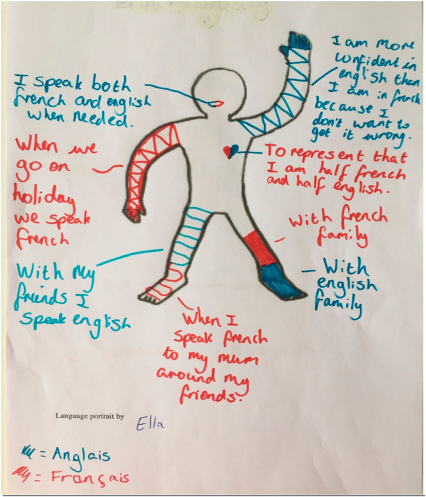

# 1.LANGUAGE PORTRAITS

**In this module, you will...**

- 1.1 Read and reflect on the preface of the Universal Declaration of Linguistic Rights, by Carles Torner Pifarré.
- 1.2 Discover what a linguistic portrait is, create your own and be ready to share it with the others.

## 1.1 Universal Declaration of Linguistic Rights. 
- Read the text [here](/01-M.LINGUISTIC_PROFILES/Universal_rights.md)

## 1.2 What is a language portrait?

The linguistic portrait, also known as a language portrait, is a visual representation of an individual's linguistic repertoires, which uses the outline of an of the linguistic repertoires of individuals, using the outline of a body silhouette. It was originally developed as a linguistic awareness exercise in educational linguistic awareness exercise in educational settings, but it is increasingly being used as a research tool to study how speakers interpret their multilingual practices and repertoires. 

### 1.2.1 Advantages of the language portrait

- It allows participants to capture a first-person visual and narrative account of their linguistic repertoires. This makes it possible to reflect on communicative practices from a unique perspective. 

- Its multimodal nature, employing both visual and verbal representation, avoids the reinforcement of pre-established narrative patterns, allowing for the representation of linguistic complexities and promoting self-empowerment. 

- Ultimately, it offers a nuanced understanding of 
of individuals' linguistic repertoires that integrate biographical as well as biographical and discursive perspectives, and explores how historical discourses can shape individual experiences.  

### 1.2.2 Create your own language portrait
**Some questions to reflect on:**

1. How do you communicate with others?
2. What languages do you use in your daily life? Why do you use them?
3. How has your use of language changed over time?
4. What do you hope for the future?

### 1.2.3 How to Create a language portrait

- Draw a body silhouette or use a pre-made one like the one on this [PDF](http://cosmozonas.github.io/01-M.LINGUISTIC_PROFILES/language_portrait.pdf). You can also make a digital version of it, adding photos to the silouhette, as if it were a collage. 

- Choose colors, symbols and also words that represent your feelings or connections to the languages you know (for example, a person might use red to represent their native language, which they associate with warmth and passion, and place it around the heart area.Blue might be used for a second language that they associate with calmness and professionalism, perhaps placed around the head to signify intellectual use).
  
- Place these elements on the silhouette in a way that reflects how you perceive these languages within yourself. For example, a language close to your heart might be placed on the chest area of the silhouette.Find some examples of language portraits [here.](https://www.bing.com/images/search?q=Language+Portrait+Template&form=HDRSC3&first=1)

- Be as visually clear as possible in your depictions, since you'll show this material to the other two students who do not know your speak your language. 

- Keep your portrait and be ready to show it in the video-call sessions!

-------------------------------------------------------------------------------------
##### [BACK TO TOP](README.md)   
##### [NEXT MODULE](/02-M.LANGUAGE_CLASSIFICATIONS/)
