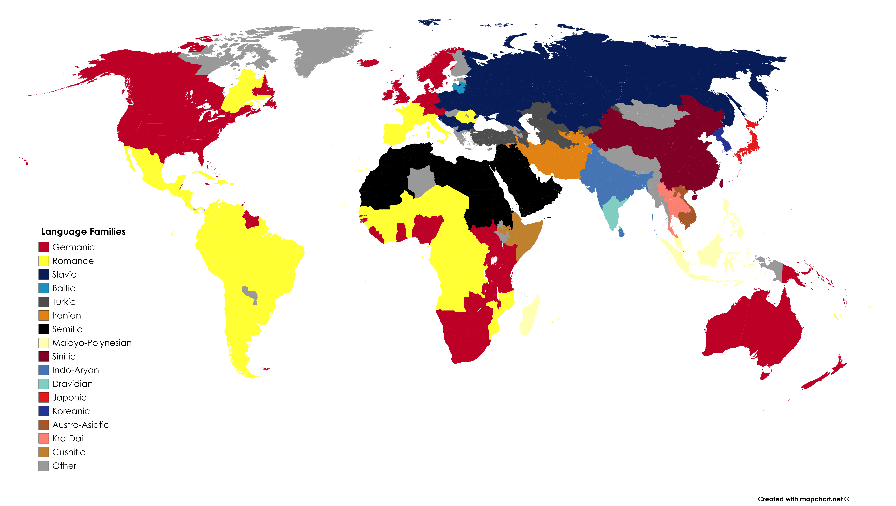

## THINK ABOUT THIS...
- How many languages do you think there are in the world?
  - A. Less than 100
  - B. Less than 1000
  - C. Less than 3000
  - D. More than 4000
  
## ANSWER
  There are currently approximately 7,139 languages in the world.

## CLASSIFICATION OF LANGUAGES
Languages can be classified into groups or families according to three main criteria: **genetic**, **typological** and **geographical**.Now, we will see each type of classification one by one, with examples to help you understand.

| TYPE     | Explanation |
|----------|----------|
|GENETIC| It is based on kinship and affinity relations between languages.   |
|TYPOLOGICAL| It is based on the common characteristics of languages.    |
|GEOGRAPHICAL| It is based on the distribution of languages in geographical areas.   |

## GENETIC
Genetic classification aims to organize languages into families based on their historical connections. Take the **Indo-European family**, for instance, which includes subfamilies like Germanic and Celtic. The Germanic subfamily encompasses languages such as German, English, Dutch, Swedish, Norwegian, and Danish, while the Celtic subfamily includes Irish, Welsh, Breton, among others. 

## INFOGRAPHIC: FAMILY CLASSIFICATIONS
This [infographic](https://www.researchgate.net/figure/Major-languages-of-the-world-presented-in-the-format-of-family-tree-Courtesy-Minna_fig1_345732504) from Minna Sundberg shows the Indo-European and Uralic language families.

## TIPOLOGICAL
This is a diagram showing the typological classification of languages (based on the internal structure of the languages). You will the explanation and some examples in the following slides.

## ISOLATING LANGUAGES
An isolating language is one in which all the words are morphologically unanalyzable (i.e., in which each word is composed of a single morpheme). This means that they do not use affixes or words are not altered to express grammatical relationships. That is the case of Mandarin Chinese.

- 我喜欢你 (Wǒ xǐhuān nǐ)
- 我 (Wǒ) means **“I”**
- 喜欢 (Xǐhuān) means **“like”**
- 你 (Nǐ) means **“you”**
The sentence translates to “I like you” in English. Notice that there are no changes to the words to indicate tense, case, or number.

## SYNTHETIC LANGUAGES
Their words are composed of several morphemes and vary to express word modifications. They have suffixes and prefixes and variations in verb conjugation. As many basic relations can be expressed by morphological means, word order is usually less strict than in isolating languages. They can be classified into **agglutinating** and **flectional**

## A. AGGLUTINATING
In these languages, the word forms can be segmented into morphs, each of which represents a single grammatical category. Turkish is a well-known agglutinative language.
(Turkish, Japanese, Korean)
In Turkish, you can see how a single word can be built up with multiple affixes to convey a complex idea. For instance, the word “evlerden” means “from the houses” and is composed of:

- **“ev”** (house)
- **“-ler”** (plural suffix)
- **“-den”** (from)

## B. FLECTIONAL/FUSIONAL
These languages use inflections where a single affix represents multiple grammatical categories. The older Indo-European languages, such as Latin, are often cited as examples of inflecting languages. 
In Spanish, the verb form changes to reflect not only tense but also subject pronoun. For instance, the verb “hablar” (to speak) can be inflected as follows:

- Hablo (I speak)
- Hablas (You speak)
- Habla (He/She/It speaks)
- Hablamos (We speak)
- Habláis (You all speak)
- Hablan (They speak)
- Here, the endings -o, -as, -a, -amos, -áis, -an indicate who is speaking as well as when the action is taking place (present tense).

## POLYSYNTHETIC 
These languages typically have complex words that can express what would be a whole sentence in other languages. An example of a polysynthetic language is Inuktitut.In Inuktitut, a single word can contain information that in other languages would require a full sentence. For example, the word ‘tusaatsiarunnanngittualuujunga’ translates into English as ‘I cannot hear anything’. Broken down, the word consists of:

- tusaatsia - listen
- runnanngittu - nothing
- aluu - able
- junga - first person singular present indicative

## GEOGRAPHICAL

Language Families of the World (Updated) 
Languages categorized by their geographical distribution.

