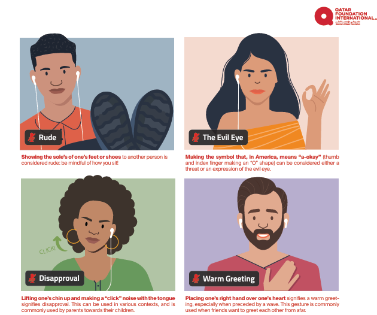

# 4. NON-VERBAL COMMUNICATION

## In this module, you will...

- 4.1 Watch a TED talk video on the power of non-verbal communication. 
- 4.2 Learn about body language and non-verbal communication related to Arabic, Spanish and Chinese conventions with a presentation in [Twine](./Twine/WORLD%20COMMUNICATION%20CENTRE.html)

# 4.1 WHAT IS NON-VERBAL COMMUNICATION?

Non-verbal communication is fundamental in languages because it conveys a great deal of information that goes beyond words. Non-verbal elements such as tone of voice, intonation, posture and eye contact complement and enrich the verbal message, allowing a better understanding of the interlocutor and revealing emotions and attitudes that may not be expressed verbally. In addition, non-verbal communication can be a more reliable indicator of a person's intentions or feelings, as it occurs more subconsciously and is less susceptible to conscious control. Non-verbal communication is essential for full and effective human interaction, and its study and understanding can significantly improve the quality of our communication. Now you are going to watch a [TED Talk](https://www.youtube.com/watch?v=fLaslONQAKM&t=11s) by Joe Navarro 

# 4.2 
Body language and non-verbal features bridge gaps in cross-cultural communication and enhance your connection with others. However, they may vary greatly from culture to culture. Here you will find a selection of some of those non-verbal traits typical of cultures where our three target languages belong.

## 4.2.2 NON-VERBAL COMMUNICATION IN THE ARAB WORLD
Explore the following resources to find out more about non-verbal communication in the arab world. 

VIDEO: [Arabic hand gestures and what they mean](https://www.youtube.com/watch?v=HGdQeUuUT3g) 

INFOGRAPHIC:

Access the complete resource [here](https://www.qfi.org/resources/infographics/non-verbal-communication-in-the-arab-world/

### 4.2.3 NON-VERBAL COMMUNICATION IN CHINA

### 4.2.4 NON-VERBAL COMMUNICATION IN SPANISH CULTURE

  